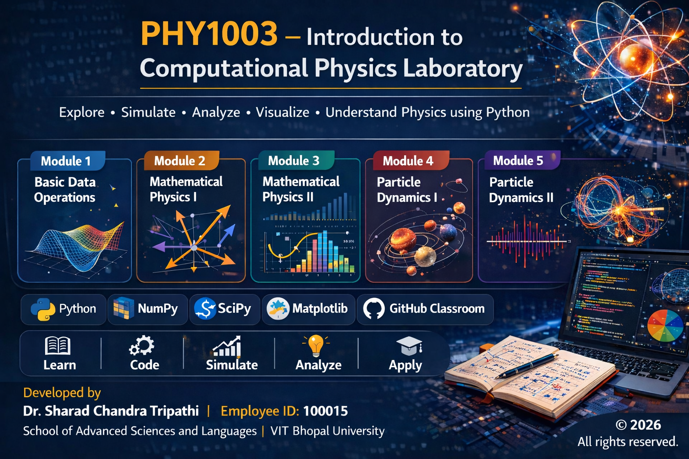

  

# PHY1003-Introduction-to-Computational-Physics-Lab

## Citation

If you use this material for teaching, research, or academic purposes, please cite:

Tripathi, S.C. (2026).  
PHY1003 – Introduction to Computational Physics Lab.  
School of Advanced Sciences and Languages,  
VIT Bhopal University.  
GitHub Repository.
